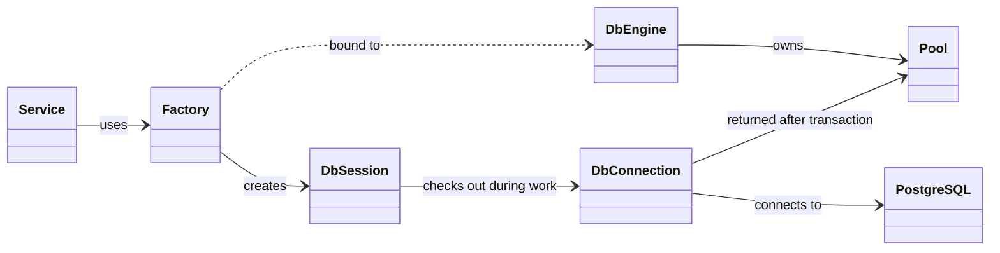
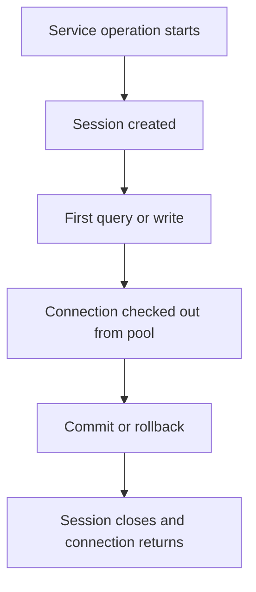

# Database Sessions and Connection Pooling

This guide explains how the Module 05 application reaches PostgreSQL and how SQLAlchemy manages request-scoped database work.

## Big picture

The application uses these objects in a simple chain:



- A service uses the **session factory** for database work.
- The **Engine** owns the connection pool, and the factory is configured with the Engine.
- The **session factory** creates short-lived Sessions.
- A **Session** represents one unit of database work.
- The Session borrows a connection from the pool when it needs to run SQL.
- The connection returns to the pool after the transaction and Session finish.
- PostgreSQL executes the SQL and stores the durable data.
- The ORM **Base** collects the table definitions used to create and query the database tables.

The rest of this guide explains each object, how they work together, and how
transactions and connection limits affect the application.

## Main objects

| SQLAlchemy object | Purpose | Comparable Java concept |
|---|---|---|
| `engine` | Owns the database connection pool. | `DataSource` / JDBC connection pool |
| database connection | A live network connection to PostgreSQL. | `java.sql.Connection` |
| `Session` | Tracks ORM objects and one unit of work. | JPA `EntityManager` or Hibernate `Session` |
| `session_factory` | A callable factory that creates `Session` objects. | `EntityManagerFactory` creating an `EntityManager` |
| `Base` | Shared SQLAlchemy model registry and metadata collection. | JPA entity metadata |

## ORM models

ORM means **object-relational mapping**. SQLAlchemy maps Python classes to
relational tables, attributes to columns, and relationships to foreign keys.
The models in [`app/models/`](../app/models/) define the database shape:

- `Project` maps to the `projects` table.
- `Task` maps to the `tasks` table.
- `Task.project_id` stores the foreign key to `projects.id`.
- `Project.tasks` and `Task.project` let Python code navigate the relationship.

The ORM converts queries and object changes into SQL, but PostgreSQL still
enforces constraints, generates IDs, runs transactions, and stores the data.

## How the application creates tables

The setup script creates the database and local database user account. The application creates the `projects` and `tasks` tables when it starts for the first time against that empty database.

Every ORM model inherits the shared `Base` class. `DeclarativeBase` gives SQLAlchemy a shared model registry and `Base.metadata`. As models declare table names, columns, primary keys, foreign keys, and indexes, SQLAlchemy adds those definitions to `Base.metadata`.

For example, the `Project` model declares its table name and primary key:

```python
class Project(Base):
    __tablename__ = "projects"

    id: Mapped[int] = mapped_column(primary_key=True)
    name: Mapped[str] = mapped_column(String(100), nullable=False)
```

The `Task` model declares its table name and the foreign key that connects each Task to a Project:

```python
class Task(Base):
    __tablename__ = "tasks"

    project_id: Mapped[int] = mapped_column(
        ForeignKey("projects.id"),
        nullable=False,
        index=True,
    )
```

When FastAPI starts, the lifespan function:

- Collects table definitions from the ORM models.
- Asks SQLAlchemy to create missing tables, columns, primary keys, foreign keys, and indexes.

```python
@asynccontextmanager
async def lifespan(application: FastAPI):
    settings = Settings()
    database = create_database(settings)
    Base.metadata.create_all(bind=database.engine)
    yield
```

`create_all()` runs at every API startup, but:

- It creates only tables that do not already exist.
- It leaves existing tables unchanged after the first successful startup.
- It does not update an existing table when an ORM model changes.

For this first persistence module, automatic creation keeps setup focused on
models, sessions, and layers. In a production application, use database
migrations—commonly Alembic with SQLAlchemy—to version and apply later schema
changes deliberately.

## Application-scoped services and operation-scoped Sessions

At startup, the application:

- Creates one stateless service for each resource.
- Stores those services on `app.state`.
- Gives each service the long-lived `session_factory`, not a shared `Session`.
- Creates a `DatabaseInfrastructure` object that groups the Engine and the
  session factory created from validated settings.

```python
settings = Settings()
database = create_database(settings)
Base.metadata.create_all(bind=database.engine)

application.state.project_service = DatabaseProjectService(
    database.session_factory
)
```

`DatabaseInfrastructure` keeps the Engine and its session factory together as
one application-scoped database dependency. Services receive only the session
factory because they do not need to manage the Engine directly.

FastAPI injects the service into a route through a small dependency:

```python
def get_project_service(request: Request) -> ProjectService:
    return request.app.state.project_service


def create_project(
    data: ProjectInput,
    service: ProjectService = Depends(get_project_service),
) -> Project:
    return service.create_project(data)
```

The router is an HTTP adapter:

- It does not create a Session.
- It does not decide when to commit.
- The service creates one Session inside the business operation.
- The service passes that Session to all repositories in the operation.
- The same service operation can be called by a route, message consumer, scheduled job, or command-line program.

```text
HTTP route / message consumer / job
                ↓
             Service
                ↓
      Session factory creates Session
                ↓
          Repositories → PostgreSQL
```

For read-only operations, the service creates and closes a Session:

```python
def get_project(self, project_id: int) -> Project:
    with self._session_factory() as session:
        project = ProjectRepository(session).get_by_id(project_id)
        if project is None:
            raise ProjectNotFoundError
        return project
```

For write operations, `session_factory.begin()` creates the Session and transaction:

- Successful completion commits the transaction.
- An exception from any code in the block rolls it back.

```python
def create_project(self, data: ProjectInput) -> Project:
    with self._session_factory.begin() as session:
        project = ProjectRepository(session).create(data)
        session.refresh(project)
        return project
```

## Session versus connection

A Session is not a permanent one-to-one database connection. It is a unit of
work that borrows a connection from the Engine's pool only when database work
is required.



During a typical request:

- A Session may be created before it borrows a connection.
- Database work usually checks out one connection from the pool.
- The connection is not permanently assigned to the Session.
- Closing the Session returns the connection to the pool.
- This course project uses one database Engine; advanced applications can use more than one.

## Transactions

Transaction behavior:

- SQLAlchemy starts a transaction when a Session first performs database work.
- `session_factory.begin()` defines the boundary around each write operation.
- `flush()` sends pending SQL so generated values, such as an ID, are available.
- `flush()` does not make the change permanent.
- Normal context-manager exit commits the transaction.
- An exception rolls it back and is re-raised.

### PostgreSQL `READ COMMITTED`

PostgreSQL uses `READ COMMITTED` as its default isolation level:

- A `SELECT` sees only data committed before that statement began.
- A `SELECT` never sees another transaction's uncommitted changes.
- Two `SELECT` statements in the same transaction can see different committed data if another transaction commits between them.
- A write that targets a row being changed by another transaction waits for that transaction to finish.
- After the wait, PostgreSQL rechecks the row against the `UPDATE` or `DELETE` condition before applying the statement.

`READ COMMITTED` prevents dirty reads, but it does not make every transaction
see one frozen snapshot. Applications that need repeatable reads or stronger
coordination must choose a stricter isolation level or use explicit locking.

For example, if two transactions update the same column, the second write can
wait for the first and then overwrite its committed value. This is commonly
described as **last update wins**. The application should use an explicit
conflict strategy, such as a version column or conditional update, when
silently replacing another user's change would be a problem.

### A simple editing conflict

Imagine two librarians edit the same Project name:

1. Alice reads `"API Design"` and changes it to `"API Design - Final"`.
2. Bob read the original value earlier and changes it to `"API Design - Draft"`.
3. Alice commits first. Bob's write waits, then commits afterward.
4. The final value is Bob's value because the later update wins.

Two common ways to reject that silent overwrite are:

**Optimistic concurrency with a version column**

Store a `version` integer and update only when it still matches the value the
client originally read:

```sql
UPDATE projects
SET name = :new_name, version = version + 1
WHERE id = :project_id AND version = :expected_version;
```

If the update affects zero rows, another transaction changed the Project first;
the service can return a conflict instead of overwriting it.

**Pessimistic locking with `FOR UPDATE`**

Within a transaction, lock the row before editing it:

```sql
SELECT id, name, version
FROM projects
WHERE id = :project_id
FOR UPDATE;
```

Another transaction trying to lock that row waits. After the lock is acquired,
the application should read the current value, validate its change, and then
update or reject it. A lock by itself does not prevent an application from
blindly replacing the latest value.

`FOR UPDATE` locks the selected rows until the surrounding transaction commits
or rolls back. Other transactions that try to update, delete, or lock those
rows wait for the lock to be released.

### Choosing a conflict strategy

| Strategy | Advantages | Trade-offs |
|---|---|---|
| Optimistic version check | No lock during ordinary reads; good when conflicts are uncommon; concurrent users do not block one another. | The update can fail and the user must reload or merge; requires a version column or equivalent condition. |
| Pessimistic `FOR UPDATE` lock | Prevents competing edits from proceeding at the same time; useful when conflicts are likely or the decision must use the latest row. | Holds a database lock while the transaction is open; other work waits, and long transactions can reduce throughput or contribute to deadlocks. |

## Default connection-pool settings

The application loads `Settings` once at startup and creates its Engine from
the validated values:

```python
settings = Settings()
database = create_database(settings)
engine = database.engine
```

Set `DATABASE_ECHO_SQL=true` in `.env` during development to print generated SQL
in the server terminal. `Settings` validates the value and passes it to
`create_engine()`. This is useful for learning and debugging, but it can be
noisy and should not normally be enabled in production.

For PostgreSQL, SQLAlchemy’s default `QueuePool` settings are:

| Setting | Default | Meaning |
|---|---:|---|
| `pool_size` | 5 | Connections kept in the pool after use. |
| `max_overflow` | 10 | Extra temporary connections allowed during busy periods. |
| Maximum concurrent connections | 15 | `pool_size + max_overflow`. |
| `pool_timeout` | 30 seconds | How long to wait for a connection when the pool is full. |

Pool behavior:

- The pool starts empty and opens connections only as needed.
- If all 15 connections are in use, another Session waits up to 30 seconds.
- If no connection becomes available, SQLAlchemy raises a pool timeout error.

The limit applies per application process or pod. Four pods with the default settings could use up to 60 PostgreSQL connections.

## Finding the bottleneck across server limits

The database pool is only one capacity limit. A request may also wait for an
application worker, the event loop, or a worker thread.

- Synchronous path operations and dependencies use Starlette/AnyIO's shared worker-thread capacity.
- The default AnyIO limiter is 40 tokens.
- Up to 40 synchronous operations can run concurrently before more work waits.
- `async def` path operations do not consume this synchronous capacity merely because they are path operations.

For the local command used in this course, Uvicorn starts one application
worker by default. Each additional worker is a separate process with its own
thread capacity and SQLAlchemy connection pool:

```text
FastAPI process (one worker by default)
    ↓
AnyIO thread capacity: 40 tokens
    ↓
SQLAlchemy QueuePool: 5 pooled + 10 overflow = 15 checked-out maximum
    ↓
PostgreSQL connection, CPU, memory, and storage capacity
```

The process-local limits are not global. Four worker processes could each have
their own pool, so the database may receive up to four times the per-process
connection capacity.

Think about the request path as several queues:

```text
Application workers/processes
        ↓
AnyIO worker-thread capacity for synchronous FastAPI work
        ↓
SQLAlchemy connection pool
        ↓
PostgreSQL execution capacity
```

The smallest available capacity, or the slowest stage, can become the bottleneck:

- A larger database pool does not help if endpoint threads are busy.
- More thread capacity does not help if PostgreSQL is saturated.
- More workers multiply process-local pools and can increase database pressure.

When demonstrating load:

- Compare request latency with server observations.
- Monitor thread waits, connection checkout time, active and idle connections, query latency, database CPU, and PostgreSQL connection limits.
- Treat the first resource that stays saturated as a likely bottleneck.
- Change one limit at a time and measure again.
- Remember that more threads use more memory and more database connections can overwhelm PostgreSQL.

## Configuring pool settings

Pool settings are not automatically read from `.env`. `create_engine()` must be explicitly given the settings.

The `DATABASE_URL` in the course `.env.example` uses the simple
`postgres:postgres` credentials created by the local setup script. Those values
are for classroom development only. Production systems should use unique
credentials supplied through protected environment configuration or a secret
manager such as HashiCorp Vault or AWS Secrets Manager, and those credentials
must never be committed to Git.

For this project, environment variables would be a good approach because each environment can choose values without changing source code.

Add settings to `.env`:

```text
DATABASE_POOL_SIZE=5
DATABASE_MAX_OVERFLOW=10
DATABASE_POOL_TIMEOUT_SECONDS=30
```

Then configure the Engine in `app/database/session.py`:

```python
engine = create_engine(
    DATABASE_URL,
    pool_size=int(os.getenv("DATABASE_POOL_SIZE", "5")),
    max_overflow=int(os.getenv("DATABASE_MAX_OVERFLOW", "10")),
    pool_timeout=int(os.getenv("DATABASE_POOL_TIMEOUT_SECONDS", "30")),
)
```

For this small local course project, the default values are appropriate. Before changing settings in a deployed application, account for the number of pods, worker processes, database connection limits, and how long requests hold transactions open.

## Source

- [SQLAlchemy connection pooling documentation](https://docs.sqlalchemy.org/21/core/pooling.html)
- [SQLAlchemy engine configuration documentation](https://docs.sqlalchemy.org/21/core/engines.html)
- [Starlette thread pool documentation](https://www.starlette.io/threadpool/)
- [FastAPI async and sync path operations](https://fastapi.tiangolo.com/async/)
